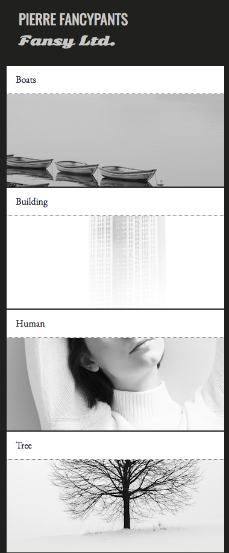
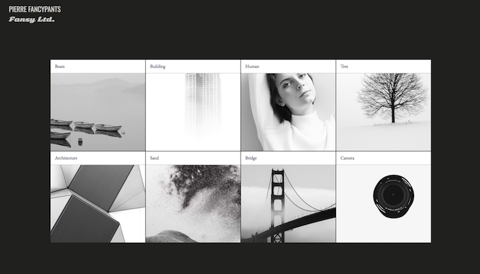

# CSS Grid

A web development activity that requires independent learning.  Build upon existing knowledge of CSS grids and utilize Google and or collaborate with classmates to work through blocks.  

Working from scratch, build the design layouts below: 
 
Working from scratch, build the layouts below:

Mobile:

Desktop:

